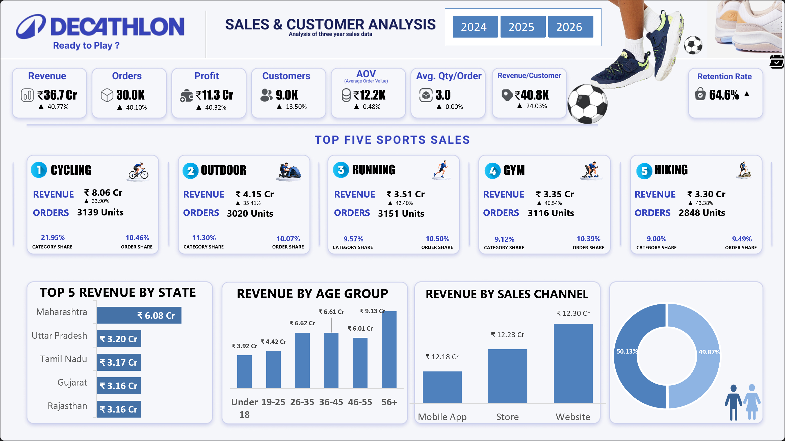
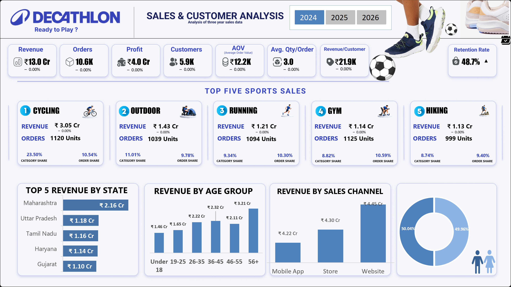
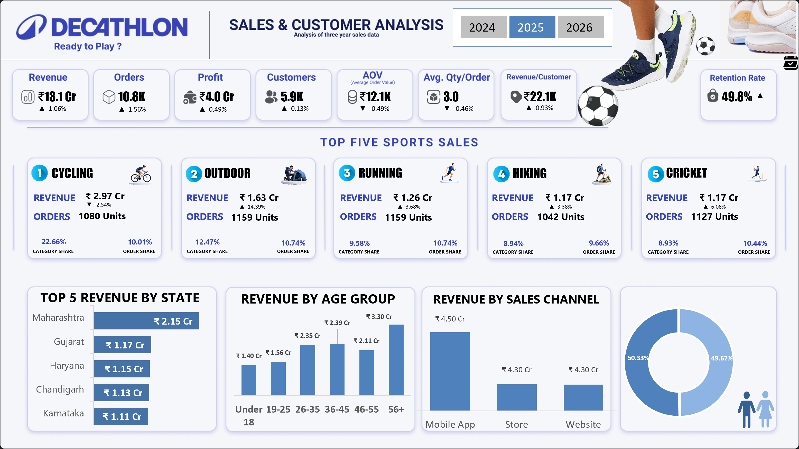

# Decathlon Sales Dashboard 📊

An interactive sales analytics dashboard built in **Microsoft Excel**, with the visual layout and dashboard structure planned using **Figma**.

This project focuses on transforming raw sales data into an interactive dashboard to understand sales performance, profitability, customer behaviour, retention, and product/category performance.

---

## 📌 Project Overview

The objective of this project was to take a structured sales dataset and build an interactive analytical dashboard that presents important business metrics in a clear and visually engaging way.

The project covers the complete journey:

**Raw Data → Data Preparation → Analysis → Visualization → Interactive Dashboard**

The dashboard allows users to explore performance across different years using interactive year filters and provides a consolidated view of key sales and customer metrics.

---

## 🎯 Objectives

The main objectives of the project were to:

- Analyze overall sales and profitability
- Track order and customer performance
- Understand customer retention
- Compare year-wise performance
- Analyze sales across different sports/categories
- Identify top-performing states
- Compare different sales channels
- Analyze revenue across customer age groups
- Present important KPIs in a single interactive dashboard
- Create a clean and user-friendly dashboard layout
- Combine analytical functionality with effective visual design

---

## 🛠️ Tools & Technologies

### Microsoft Excel

Excel was used for:

- Data preparation
- Data analysis
- Excel formulas
- Pivot Tables
- Pivot Charts
- KPI calculations
- Slicers
- Interactive dashboard development

### Figma

Figma was used for:

- Dashboard layout planning
- Visual hierarchy
- Component placement
- Dashboard structure
- Design experimentation before implementation in Excel

---

## 📂 Project Files

| File | Description |
|---|---|
| `Decathlon_Raw.xlsx` | Raw dataset used for the analysis |
| `Decathlon_Sales_Dashboard.xlsx` | Final interactive Excel dashboard |
| `Dashboard.png` | Main dashboard preview |
| `Dashboard_Filter_Year_2024.png` | Dashboard filtered for 2024 |
| `Dashboard_Filter_Year_2025.png` | Dashboard filtered for 2025 |
| `Dashboard_Demo.mp4` | Short dashboard walkthrough video |

---

## 📊 Dashboard Preview

### Main Dashboard



The dashboard provides a consolidated view of:

- Revenue
- Orders
- Profit
- Customers
- Average Order Value
- Average Quantity per Order
- Revenue per Customer
- Customer Retention Rate

---

## 🔎 Dashboard Components

### 1. KPI Overview

The dashboard provides the following high-level KPIs:

- Revenue
- Orders
- Profit
- Customers
- Average Order Value (AOV)
- Average Quantity per Order
- Revenue per Customer
- Customer Retention Rate

These KPIs provide a quick overview of overall business performance.

---

### 2. Year-wise Analysis

The dashboard includes year filters for:

- 2024
- 2025
- 2026

This allows users to compare performance across different periods and understand changes in sales and customer metrics.

### 2024 View



### 2025 View



2026 is included as an ongoing year, so its performance should be interpreted based on the period currently available in the dataset.

---

### 3. Top Sports by Sales

The dashboard highlights the top five sports/categories by revenue.

| Rank | Sport | Revenue |
|---:|---|---:|
| 1 | Cycling | ₹8.06 Cr |
| 2 | Outdoor | ₹4.15 Cr |
| 3 | Running | ₹3.51 Cr |
| 4 | Gym | ₹3.35 Cr |
| 5 | Hiking | ₹3.30 Cr |

**Cycling** is the strongest contributor among the top five sports, with revenue of approximately **₹8.06 Cr**.

---

### 4. Revenue by State

The dashboard identifies the highest-revenue states.

| Rank | State | Revenue |
|---:|---|---:|
| 1 | Maharashtra | ₹6.08 Cr |
| 2 | Uttar Pradesh | ₹3.20 Cr |
| 3 | Tamil Nadu | ₹3.17 Cr |

This view helps identify geographical areas with stronger sales contribution.

---

### 5. Revenue by Age Group

Revenue is analyzed across different customer age groups to understand how different customer segments contribute to overall sales.

This provides a demographic perspective beyond overall revenue and order metrics.

---

### 6. Revenue by Sales Channel

The dashboard compares revenue across different sales channels to understand how customers are purchasing and which channels contribute more to overall revenue.

---

## 📈 Key Metrics

Based on the dashboard's overall view:

| Metric | Value |
|---|---:|
| Total Revenue | ₹36.71 Cr |
| Total Profit | ₹11.3 Cr |
| Total Orders | 30,000 |
| Total Customers | 8,998 |
| Average Order Value | ₹12.2K |
| Average Quantity / Order | 3 |
| Revenue / Customer | ₹40.8K |
| Customer Retention | 64.6% |

---

## 💡 Key Insights

### Revenue & Profit

- Total revenue stands at approximately **₹36.71 Cr**.
- Total profit is approximately **₹11.3 Cr**.
- The dashboard provides a consolidated view of both revenue generation and profitability.

### Customer & Order Performance

- The dataset contains approximately **30,000 orders**.
- These orders come from approximately **8,998 customers**.
- Average quantity per order is approximately **3 units**.
- Average Order Value is approximately **₹12.2K**.

### Customer Retention

- Overall customer retention is approximately **64.6%**.
- The retention metric provides an indication of repeat customer behaviour across the analyzed period.

### Year-wise Performance

- **2025 sales increased by approximately 1.06% compared with 2024.**
- **2026 currently shows lower sales than 2025 by approximately 18.88%.**
- However, **2026 is an ongoing year**, so this should not be treated as a complete-year comparison with 2025.

### Category Performance

- **Cycling** is the leading sport/category by revenue at approximately **₹8.06 Cr**.
- Outdoor, Running, Gym, and Hiking follow among the top five categories.

### Customer Contribution

- Female customers contributed approximately **₹18.31 Cr** in revenue.
- Male customers contributed approximately **₹18.40 Cr**.
- Revenue contribution from both groups is therefore relatively balanced.

---

## 🎨 Dashboard Design

The dashboard layout was initially planned using **Figma** before being implemented in Excel.

The design process focused on:

- Clear KPI hierarchy
- Consistent spacing
- Visual grouping
- Easy-to-read charts
- Minimal visual clutter
- Interactive filtering
- Consistent typography
- Business-focused presentation

The objective was to combine analytical functionality with a clean and intuitive visual experience.

---

## 🔄 Interactive Features

The Excel dashboard includes interactive elements that allow users to explore the data dynamically.

### Year Slicers

Users can switch between:

**2024 | 2025 | 2026**

The dashboard updates based on the selected year.

### Dynamic Analysis

Charts and KPIs respond to the selected filters, allowing users to explore different aspects of the dataset without manually changing the underlying analysis.

---

## 🎥 Dashboard Demonstration

A short walkthrough video is included in the repository.

**[▶ View Dashboard Demo](Dashboard_Demo.mp4)**

The video demonstrates the dashboard, navigation, visualizations, and year-wise filtering.

---

## 📁 Project Structure

```text
Decathlon-Sales-Dashboard/
│
├── Decathlon_Raw.xlsx
├── Decathlon_Sales_Dashboard.xlsx
│
├── Dashboard.png
├── Dashboard_Filter_Year_2024.png
├── Dashboard_Filter_Year_2025.png
├── Dashboard_Demo.mp4
│
├── Images/
│
└── README.md
